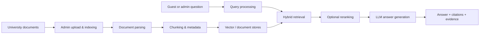

<div align="center">

# KURAGa

### KU Retrieval-Augmented Guide Assistant

**A university-document RAG chatbot built for the KU / WFI Digital Projects course.**

KURAGa helps students and staff ask questions over indexed university and study-program documents, with retrieved evidence, citations, guest access, and a local-first model setup.

[](#quick-start)
[](#how-kuraga-works)
[](#using-the-app)
[](#docker-setup)
[](#license-and-attribution)

</div>

---

## What is KURAGa?

**KURAGa** is a student-built Retrieval-Augmented Generation assistant for university documents. It was developed as part of the **Digital Projects** course at KU / WFI and is designed around a practical problem: students often need answers hidden inside examination regulations, module catalogues, study plans, forms, flyers, and other PDF-heavy university documents.

Instead of asking a language model to answer from memory, KURAGa first retrieves relevant passages from the indexed document collection and then generates an answer grounded in that context.

> [!IMPORTANT]
> **KURAGa is a course project, not an official KU service.**
> Answers can be incomplete or wrong. Always verify important academic, legal, or administrative decisions against official university documents or university staff guidance.

---

## Why this project exists

University information is often distributed across many documents, formats, languages, and update cycles. A normal chatbot can easily hallucinate. A plain keyword search can miss relevant passages. KURAGa combines both approaches:

* **document search** to find relevant evidence,
* **language generation** to explain it clearly,
* **citations/evidence** to let users verify the answer,
* **guest mode** so anyone can try the chatbot without accessing admin tools,
* **admin-managed indexing** so the document base stays controlled.

The result is a focused RAG assistant for university-programme questions rather than a generic document-chat demo.

---

## Highlights

| Area                          | What KURAGa provides                                                                                   |
| ----------------------------- | ------------------------------------------------------------------------------------------------------ |
| **Guest chat**                | Guests can ask questions over all admin-indexed documents without upload or admin access.              |
| **Search All by default**     | Guest users are scoped to the complete indexed university document base.                               |
| **Admin document management** | Admins can upload, index, and manage university document collections.                                  |
| **Evidence-aware answers**    | Answers include retrieved context/citations so users can check the source.                             |
| **University-document focus** | The project is adapted for study regulations, module catalogues, forms, flyers, and similar documents. |
| **Local-first models**        | Designed to work with Ollama/OpenAI-compatible local LLM and embedding endpoints.                      |
| **Evaluation tooling**        | Includes curated datasets and scripts for checking RAG answer quality.                                 |
| **In-app documentation**      | Guest users can read project documentation directly inside the UI.                                     |

---

## How KURAGa works



At a high level:

1. **Admins index documents** such as PDFs, module catalogues, study plans, regulations, or forms.
2. KURAGa parses the documents, splits them into searchable chunks, and stores them in retrieval indexes.
3. A user asks a question in the chat UI.
4. The retrieval pipeline finds relevant passages from the indexed collection.
5. The LLM generates an answer using the retrieved context.
6. The UI displays the answer together with source evidence/citations.

---

## Repository structure

| Path              | Purpose                                                                                                                                          |
| ----------------- | ------------------------------------------------------------------------------------------------------------------------------------------------ |
| `src/ktem/`       | Gradio application layer: UI pages, chat, login/guest access, settings, evaluation, file index UI.                                               |
| `src/kotaemon/`   | Reusable RAG components inherited/adapted from Kotaemon: loaders, splitters, stores, retrievers, LLMs, embeddings, rerankers, QA/citation logic. |
| `flowsettings.py` | Main runtime configuration: app name, model defaults, stores, index definitions, feature flags.                                                  |
| `docs/`           | Project documentation, including in-app guest documentation.                                                                                     |
| `scripts/`        | Docker helpers, evaluation utilities, retrieval/chunking debugging tools, and project scripts.                                                   |
| `dataset/`        | Course/evaluation documents and curated question sets where applicable.                                                                          |
| `tests/`          | Project tests, including guest access/search-scope behavior.                                                                                     |
| `ktem_app_data/`  | Runtime data directory created by the app. Contains uploads, SQLite DBs, vector stores, caches. Do not commit it.                                |

> [!NOTE]
> Internal Python package names still use `kotaemon` and `ktem` for compatibility with the upstream architecture. User-facing branding uses **KURAGa**.

---

## Quick start

### 1. Clone the repository

```bash
git clone https://github.com/gerageragera39/kotaemon.git
cd kotaemon
git checkout kuraga
```

### 2. Create a Python environment

KURAGa expects **Python 3.11+**.

#### Windows PowerShell

```powershell
python -m venv .venv
.\.venv\Scripts\Activate.ps1
python -m pip install --upgrade pip
```

#### Linux / macOS

```bash
python -m venv .venv
source .venv/bin/activate
python -m pip install --upgrade pip
```

### 3. Install dependencies

```bash
pip install -r requirements_gerageragera39.txt
pip install -e .
```

### 4. Create your local environment file

#### Windows PowerShell

```powershell
Copy-Item .env.example .env
```

#### Linux / macOS

```bash
cp .env.example .env
```

Then edit `.env` if you want to change the model, embedding model, API endpoint, app name, or authentication settings.

### 5. Start the app

```bash
python app.py
```

Open:

```text
http://localhost:7860
```

The default local user-management setup may use:

```text
Username: admin
Password: admin
```

Change the default credentials immediately after first login or through your deployment configuration.

---

## Local model setup with Ollama

KURAGa is designed for a local-first setup through Ollama/OpenAI-compatible endpoints.

Install Ollama, then pull a chat model and an embedding model:

```bash
ollama pull qwen3:8b
ollama pull nomic-embed-text
```

Example `.env` values:

```env
KH_APP_NAME=KURAGa
LOCAL_MODEL=qwen3:8b
LOCAL_MODEL_EMBEDDINGS=nomic-embed-text
KH_OLLAMA_URL=http://localhost:11434/v1/
KH_OLLAMA_NUM_CTX=32768
KH_OLLAMA_NUM_PREDICT=1024
```

For stronger machines, you can replace the chat model with a larger local model. For weaker machines, use a smaller model and reduce context length if needed.

---

## Docker setup

KURAGa also includes a Docker Compose setup for local deployment with persistent app data.

### Basic Docker launch

```bash
cp .env.example .env
# Windows PowerShell: Copy-Item .env.example .env

docker compose up -d --build
```

Open:

```text
http://localhost:7860
```

### With bundled Ollama container

```bash
docker compose --profile ollama up -d --build
```

When using the bundled Ollama profile, set the app to use the Docker network endpoint:

```env
KH_OLLAMA_URL=http://ollama:11434/v1/
```

### Optional reranker service

```bash
docker compose --profile reranker up -d
```

Useful Docker commands:

| Command                         | Effect                                           |
| ------------------------------- | ------------------------------------------------ |
| `docker compose config`         | Validate the Compose file before starting.       |
| `docker compose up -d --build`  | Build and start KURAGa.                          |
| `docker compose logs -f kuraga` | Follow app logs.                                 |
| `docker compose down`           | Stop containers while keeping persistent data.   |
| `docker compose down -v`        | Stop containers and remove named Docker volumes. |

By default, app data is mounted into `./ktem_app_data` so it survives container restarts.

---

## Using the app

### Guest flow

Guests are intentionally restricted to a simple, safe interface:

1. Open the app.
2. Click **Access as Guest**.
3. Ask questions in **Chat**.
4. Read **Project Documentation** inside the app to understand scope, limitations, and attribution.

Guest users:

* can chat with indexed university documents,
* are forced to use **Search All** over admin-indexed documents,
* cannot upload files,
* cannot select only one private file,
* cannot disable document search,
* cannot access Resources, Settings, Evaluation, or admin file-management pages.

### Admin flow

Admins manage the actual knowledge base:

1. Log in as admin.
2. Configure LLM, embedding, and optional reranking models.
3. Upload university documents.
4. Index the document collection.
5. Test answers in the chat.
6. Use evaluation scripts or the Evaluation tab to inspect retrieval and answer quality.

---

## Evaluation

KURAGa includes evaluation assets for checking whether the chatbot actually answers university-document questions correctly.

Typical assets include:

| Asset                                | Purpose                                        |
| ------------------------------------ | ---------------------------------------------- |
| `rag_eval_dataset.json`              | Curated RAG evaluation questions.              |
| `rag_eval_dataset_kazi.json`         | Additional/team-provided evaluation questions. |
| `dataset/documents/`                 | Source documents for indexing/evaluation.      |
| `scripts/run_rag_eval.py`            | Runs RAG evaluation against a dataset.         |
| `scripts/debug_university_chunks.py` | Helps inspect chunking output.                 |
| `scripts/evaluate_llm_judge.py`      | Optional LLM-judge based scoring.              |
| `src/ktem/evaluation/ragas_eval.py`  | RAGAS integration used by the Evaluation page. |

Example:

```bash
python scripts/run_rag_eval.py --help
```

Run evaluation scripts from the repository root and inspect script options before using them against real data.

---

## Development workflow

### Recommended checks

```bash
python -m compileall src
pytest tests
```

If dependency installation is heavy on your machine, at least run targeted tests for the code you changed:

```bash
pytest tests/test_guest_search_scope.py
```

### Things not to commit

Do not commit local runtime data or secrets:

```text
.env
ktem_app_data/
__pycache__/
*.pyc
*.sqlite
*.db
vector stores
user uploads
local model caches
```

### Important development notes

* Run commands from the repository root.
* Keep Python imports as `kotaemon` and `ktem` unless a full migration plan proves that renaming is safe.
* Do not use old upstream `libs/kotaemon` or `libs/ktem` paths in this fork.
* Keep guest access restricted and test it after UI changes.
* Keep attribution to the original Kotaemon project visible and honest.

---

## Troubleshooting

### `ModuleNotFoundError: kotaemon` or `ktem`

Make sure you installed the project in editable mode from the repository root:

```bash
pip install -e .
```

### Ollama connection errors

Check that Ollama is running:

```bash
ollama list
```

For a host Ollama instance, `.env` should usually contain:

```env
KH_OLLAMA_URL=http://localhost:11434/v1/
```

For Docker Compose with the bundled Ollama profile, use:

```env
KH_OLLAMA_URL=http://ollama:11434/v1/
```

### The model gives weak or incomplete answers

Try:

* using a stronger local model,
* increasing context length,
* checking whether the correct documents were indexed,
* inspecting retrieved evidence,
* running the evaluation/debug scripts,
* improving chunking or metadata if relevant passages are missed.

### Guest users can access too much

Guest users should only see Chat and Project Documentation. They should not be able to upload files, select one private file, disable document search, or access admin pages. Re-run guest-related tests after changing login, tab visibility, or file-selection logic.

---

## Project status

KURAGa is an active university course project. The goal is not to replace official university systems, but to demonstrate and evaluate a practical RAG assistant for university documents.

Current focus areas:

* robust guest-only chat access,
* reliable document retrieval,
* transparent citations/evidence,
* local-first deployment,
* clean project documentation,
* evaluation-driven RAG improvements.

---

## License and attribution

This repository is based on the open-source [Cinnamon/kotaemon](https://github.com/Cinnamon/kotaemon) project, licensed under Apache-2.0.

KURAGa keeps the upstream license and retains original architecture/components where applicable, especially the internal `kotaemon` RAG library and `ktem` Gradio application layer. This fork contains substantial project-specific changes by the KU Digital Projects team for university-document retrieval, guest access, local model defaults, evaluation, and UI/documentation branding.

See:

* [`LICENSE.txt`](LICENSE.txt)
* [`NOTICE.md`](NOTICE.md)

---

<div align="center">

**KURAGa** — making university documents easier to ask, search, and verify.

</div>
